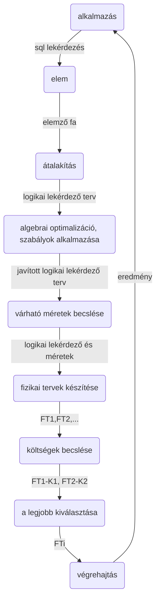

## Elemzőfa (Parse tree)

* **Statikus adatbázis** amely ritkán módosul, a lekérdezések gyorsasága a fontosabb.
* **Dinamikus adatbázis** amely gyakran módosul, ritkán végünk lekérdezést.
<!--stackedit_data:
eyJoaXN0b3J5IjpbLTE4MzMyMjY0OTRdfQ==
-->