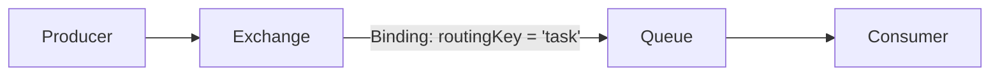

# RabbitMQ
_RabbitMQ_ support many protocols in order to achieve data resilience. **Advanced message queuing protocol (AMQP)** is the default, primarily supported communication protocol.
> * MQTT (Message Queuing Telemetry Transport)
> * STOMP (Simple/Streaming Text Oriented Messaging Protocol)
> * WebSockets
> * HTTP (Management / Messaging APIs)
## AMQP overview
A single frame sent over the network may look like this:
* first byte is the **type** of message, either can be a **__method__** (action we want to perform such as _Basic.Publish_), **__header__** (body size), **__body__** (binary data), **__heartbeat__** (indicates that the sender is still alive),
* next byte, the **channel** is stored, (virtual connection [single physical connection, but multiple independent threads of messages, each getting their own channel]),
* next byte is the **size**,
* **payload**,
* single byte indicates the **frame-end**.

An example of a sent message may look like a method, header, body, body, body.
## AMQ model
How RabbitMQ is constructed.

# Exchange
Determines **how messages are routed** to queues.

After receiving a message from a producer, the exchange decides where to route the message based on:
* exchange type,
* routing key (sent with the message),
* bindings between the exchange and queues.
## Exchange types
Exchange types determine how messages are routed:
* **topic** routes messages based on **pattern matching** of the routing key,
> __#__ matches zero or more words in the routing key.
> __*__ matches a single word.
* **fanout** routes messages to **all queues** bound to the exchange, regardless of routing key. This is like a broadcast,
* **header** routes messages based on **headers** instead of the routing key,
* **direct** routes messages to queues based on an **exact match** between the message's routing key and the queue's binding key.
* **default** routing key equals queue name.
## Bindings
A binding is a link between a queue and an exchange.

When binding a queue to an exchange, we specify a binding key **(in direct/topic exchanges)**, which helps determine whether a message should go to that queue.
# Classic queues
# Quorum queues
> It was developed to overcome the resiliency issues observed with classic queue mirroring.
# Streams
Does not necessary remove acknowledged consumes message allowing for replays or backups. Retention policy can be set for this purpose. 
# Clustered setup
**Quorum-based consensus logic** is the ability to tolerate failures in a clustered message broker setup. It is based on the **principle of majority (quorum)**. We can tolerate up to $(N-1)/2$ node failures and still remain safe and consistent (for $5$ we're fine for $2$ failures).
<!--stackedit_data:
eyJoaXN0b3J5IjpbMjAxNDM2NDE4Nl19
-->