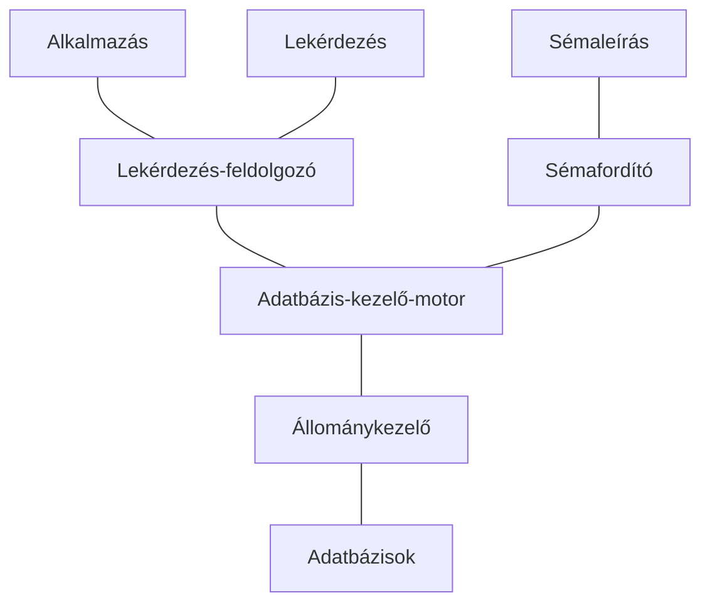

## Adatbázisok különböző szintjei
Sémák (tervek, leírások) és előfordulások (konkrét adatok, megvalósítások) és előfordulások (konkrét adatok, megvalósulások)
|  | Séma | Egy előfordulás |
|--|--|--|
| Alkalmazások | `SELECT SUM(fizetes) összfizetés FROM BER` | $30$ |
| Logikai adatbázis | `Ber(nev,fizetes) | tábla név és fiz attribútumokkal és a jelenlevő adatokkal 
| Fizikai adatbázis | szekvenciális | (BER,nev,fizetes,#2,Kiss,10,Nagy,20) |
## Fizikai és logikai adatfüggetlenség
Fizikai adatbázis módosítása (indexek készítése, az adatok más adatruktúrákban tárolása) nem látszik a felette levő szinteken

A logikai adatbázis bővítése (új táblák, oszlopok hozzáadása) esetén a régi alkalmazások változtatása nélkül ugyanúgy működjenek
## Edgar Frank Codd szabályai
1.  **Informatív integritás:** Az adatokat deklaratív módon kell meghatározni az integritási megszorításokkal, és az adatbázis-kezelő rendszernek garantálnia kell azok betartását. Az adatok konzisztens és megbízható állapotban kell legyenek.
    
2.  **Unikus azonosítás:** Minden sor egyedileg azonosítható azonosítókkal vagy kulcsokkal, amelyek lehetővé teszik a sorok egyértelmű azonosítását és hivatkozását.
    
3.  **Adattáblák és nézetek különválasztása:** Az adatbázis-kezelő rendszernek meg kell különböztetnie az adattáblákat és a nézeteket, és lehetővé kell tennie a kettő közötti különbség felfedezését.
    
4.  **Dinamikus online katalógus alapú nyelv:** Az adatleíró adatokat, például a séma és a definíciók leírását, az adatbázis kezelő rendszernek is tárolnia kell, és az ezekhez való hozzáférést a rendszernek SQL nyelven kell lehetővé tennie.
    
5.  **Integrált adatmanipuláció:** Az adatokhoz való hozzáférést és módosítást egy egységes adatmanipulációs nyelven (például SQL) keresztül kell biztosítani.
    
6.  **Konzisztens és hatékony kezelés:** A rendszernek megfelelően kezelnie kell a tranzakciókat, és biztosítania kell a konzisztenciát, az elszigeteltséget és a tartósságot.
    
7.  **Fizikai adatfüggetlenség:** Az alkalmazásoktól elválasztottan kell tárolni az adatokat, és lehetővé kell tenni az adatok fizikai tárolásának változtatását anélkül, hogy az alkalmazásokat módosítani kellene.
    
8.  **Logikai adatfüggetlenség:** Az alkalmazásoknak nem kell érzékelniük az adatok logikai szerkezetének változásait, például új attribútumok hozzáadását vagy törlését.
    
9.  **Az adatokban való manipuláció közötti egységesítés:** A relációs rendszernek lehetővé kell tennie a rekordok egységesítését és elkülönítését az alkalmazások közötti adatmanipuláció során.
    
10.  **Nem alapértelmezett közvetítő nyelv:** Az alkalmazásoknak közvetlenül SQL-t kell használniuk az adatok eléréséhez, és nem szükséges közvetítő programok vagy nyelvek alkalmazása.
    
11.  **Feltételes adatfelvétel:** Az adatbázisnak lehetővé kell tennie a feltételes adatfelvételt, amely lehetővé teszi az adatok kiválasztását és manipulációját feltételek alapján.
    
12.  **Megszakíthatatlan online operációk:** Az adatbázis-kezelő rendszernek lehetővé kell tennie az online operációk megvalósítását megszakítás nélkül, és a tranzakciók biztonságos kezelését.
<!--stackedit_data:
eyJoaXN0b3J5IjpbLTE1NzA1OTM0NzddfQ==
-->