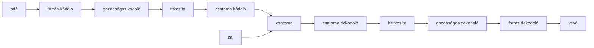
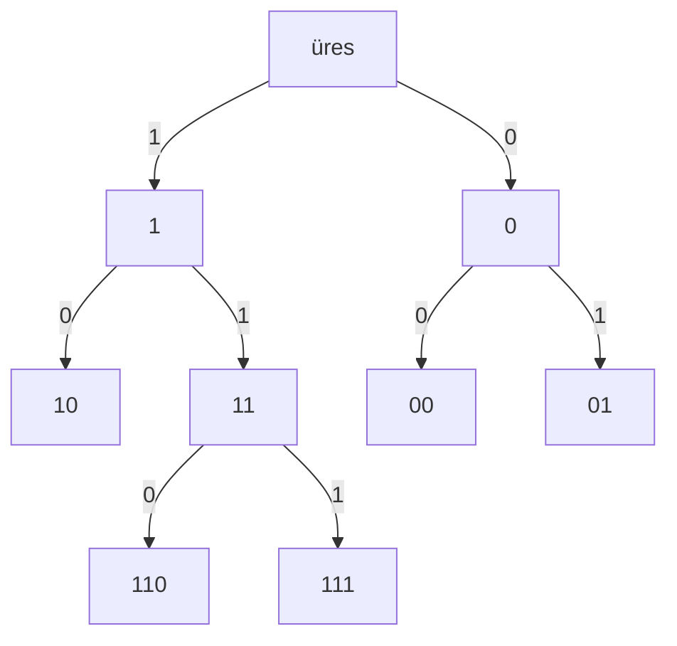
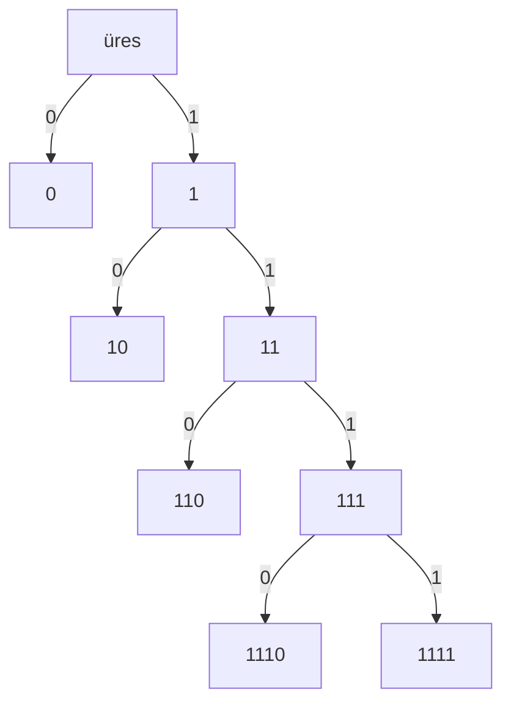

# Kódoláselmélet
## Kommunikációs csatorna

## Betűnkénti kódolás
$\mathcal X=\{x_1,x_2,...,x_n\}$ **forrásábécé**, $\mathcal Y=\{y_1,y_2,...,y_n\}$ **kódábécé**. Ekkor egy $\varphi:\mathcal X\rarr\mathcal Y^*$ **injektív** függvény betűnkénti kódolás.
> Morze-kód $\mathcal X=\{a,b,c,...\},\mathcal Y=\{\cdot,-\},\{a\rarr\cdot-,.....\}$
> ASCII $\mathcal X=\{\text{latin ábécé}+\},\mathcal Y=\{0,1\}$
> UTF-8 $\mathcal X=\{\text{latin ábécé}+\}\cup\{\text{görög ábécé}+\}\cup\{\text{cirill ábécé}+\}\cup...,\mathcal Y=\{0,1\}$

Attól még, hogy $\varphi$ injektív, még nem, biztos, hogy egyértelműen dekódolható.
## Kódfa
A fa csúcsai szavak.
A fa éleit a kódszavak lehetséges karaktereivel címkézzük.
A kódhoz tartozó kódfa az a legkevesebb csúcsot tartalmazó ilyen tulajdonságú fa, ami tartalmazza az összes kódszót.

A fa gyökerében az üres szó szerepel és egy szóhoz tartozó csúcs leszármazottai azok a szavak, amelyeket úgy kapunk, hogy a szó után írjuk az élen szereplő karaktert.
Dekódoláskor a gyökeréből indulva a biteknek megfelelő címkéjű élein haladva járjuk be a fát.

## Felbontható kódolás
Egy $\varphi:\mathcal X\rarr\mathcal Y^*$ kódolás felbontható (**egyértelműen dekódolható**), ha $u,v\in\mathcal X^*,u=u_1u_2...u_r,v=v_1v_2...v_s$ esetén, ha $u\ne v$, akkor
$$
\varphi(u_1)\varphi(u_2)...\varphi(u_r)\ne\varphi(v_1)\varphi(v_2)...\varphi(v_r)
$$
> Morze-kód nem felbontható $\varphi(s)=...=\varphi(e)\varphi(i)\qquad(\varphi(e)=\cdot,\varphi(i)=\cdot\cdot)$
> ASCII és UTF-8 felbontható
## Prefix kód
Egy olyan kód, amely esetén a kódszavak halmaza prefixmentes, azaz nincs két olyan kódszó, ami esetén az egyik a másiknak valódi prefixe lenne.

Minden prefix kód egyértelműen felbontható, azaz egy kódolt szónak nincs olyan prefixe ami már egy meglévő szó kódolata.

$\{0,10,110,1110,1111\}$.

$\{0,100,101,111\}$ is prefix, de $\{100,10,11\}$ már nem az.
### Elégséges feltétel prefix tulajdonsága
$\mathcal C\subset\mathcal Y^*$ kódszavak véges halmaza.
* $\mathcal C$ **kód egyenletes**.
* $\mathcal C$ kód **vesszős kód**.
> Minden egyes illetve vesszős kód prefix.
## Egyenletes kód
$\mathcal C\subset\mathcal Y^*$ a kódszavak végeshalmaza, ekkor a $\mathcal C$ egyenletes (blokk) kód, ha minden $c\in\mathcal C$ kódszó azonos hosszú.
> $\{000,010,111,101\}$.
>  ASCII, minden karakter $7$ biten kódolt.

$\vert\sum\vert=d$, akkor a karakterek legkevesebb $\log_rd$ bittel kódolhatók
## Vesszős kód
$\mathcal C\subset\mathcal Y^*$ a kódszavak végeshalmaza, ekkor a  $\mathcal C$ kód vesszős kód, ha van olyan $v\in\mathcal Y^*$ nemüres szó, mely szuffixe minden $c\in\mathcal C$ kódszónak, de nem prefixe, illetve infixe semelyik kódszónak.
> $\{0100,100,1100\}$.
## Szótárkódok
A betűnkénti hatékonysága korlátozott, könnyen tudunk olyan adatot adni, amit sokkal tömörebben formában lehet reprezentálni, ha a kódolás nem karakterenként történik.
Ezt az észrevételt használják ki a szótárkódok úgy, hogy egy kódszó nem csak egy karakter képe lehet, hanem egy szóé is.
<!--stackedit_data:
eyJoaXN0b3J5IjpbLTEyMjMwODc5MzVdfQ==
-->