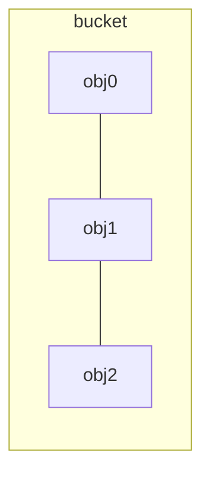

# `HashMap`
Similar to `HashTable`, but it is unsynchronized.
It takes two parameters namely as follows:
* The type of keys maintained by this map
* The type of mapped values

Keys and value can’t be primitive datatype. Key in `HashMap` is valid if it implements `hashCode()` and `equals()` method, it should also be immutable so that hashcode and equality remains constant.
> It allows to store the null keys as well, but there should be only one null key object and there can be any number of null values.
---
Uses hashing function - retrieval and insertion of nodes are usually $\Omicron(1)$ (constant) time complexity.
Makes no guarantees as to the order of the map.

**Capacity**  is the (initial) number of buckets available for storing nodes.
**Load factor**  is the measure of how full the `HashMap` can be before it is resized. 

**Rehasing** is the process of doubling the capacity of the `HashMap` and reorganizing its internal data structure to accommodate more nodes efficiently.
> It's necessary to avoid that one bucket store to many objects.
 
**Treshold** is a number calculated as **capacity * load factor** - When the number of nodes in the `HashMap` exceeds this threshold, rehashing is triggered.
## Internal working
Hashing is the process of converting an object into integer form by using `hashCode()`, it is used to calculate the index of the bucket.
`equal()` is used to determine if two objects are equal.
### Bucket
**Bucket** is an element of the `HashMap` array, it's used to store nodes. More than one node can be in the same bucket, but in this case it acts as a linked list.

### Index calculation
`index = hashCode(key) & (n-1)`
> $hashCode(key)\mod(n-1)$

Using a bitwise `AND` operator is similar to doing bit masking wherein only the lower bits of the hash integer is considered which in turn provides a very efficient method of calculating the modulus based on the length of the `HashMap`.
### Node object
```c
{
	int hash;
	Key<T> key;
	Value<T> value;
	Node next = null;
}
```
### Refering to a key
1. Calculate hash code of a key.
2. Calculate index based on the given hash code
3. Node object.
#### Key already exists
In this case there won't be another object created instead the existing one's value will be modified
#### Bucket already contains element(s)
This case occurs when the given `index` points to a bucket which already contains a node. A new object will be created to which the given node's `next` field will be refered.
> In case of multiple nodes are being on a bucket, a recursive call will be called while the `next` value is not `null`.
<!--stackedit_data:
eyJoaXN0b3J5IjpbMTAzNTU5OTQ5MV19
-->