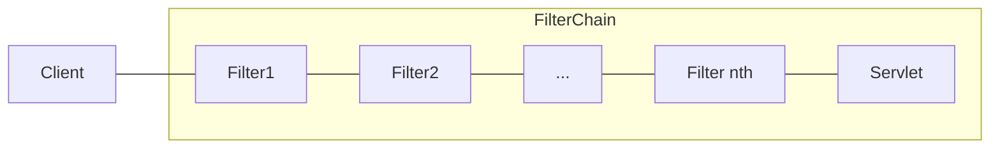

The client sends a request to the application, and the container creates a `FilterChain`, which contains the `Filter` instances and `Servlet` that should process the `HttpServletRequest`.



`Filter` can be used to
* Prevent downstream `Filter` instances or the `Servlet` from being invoked. In this case, the `Filter` typically writes the `HttpServletResponse`.
  > Downstream filters are the next filters in line to be executed
  
-  Modify the `HttpServletRequest` or `HttpServletResponse` used by the downstream `Filter` instances and the `Servlet`.

**The order of the filters are important**.
## DelegatingFilterProxy
Initially Servlet is not aware of Spring-defined Beans. 

`DelegatingFilterProxy` is a `Filter` implementation which allows bridging between Servlet container’s lifecycle and Spring’s `ApplicationContext` allowing Servlet filters to use Spring beans and services.
## FilterChainProxy
> A proxy is an intermediary that intercepts method calls or requests, adds additional behavior and delegates them to the actual target object.

Special `Filter` provided by Spring Security that allows delegating to many `Filter` instances through `SecurityFilterChain`, additionally Spring Security’s Servlet support is contained within.
### SecurityFilterChain
Used by `FilterChainProxy` to determine which Spring Security `Filter` instances should be invoked for the current request.

Security filters registered via `FilterChainProxy` instead of `DelegatingFilterProxy` because
* Provides a starting point for all of Spring Security’s Servlet support
  > On troubleshoot Spring Security’s Servlet support, adding a debug point in `FilterChainProxy` is a good intention
* Since `FilterChainProxy` is central to Spring Security usage, it can perform tasks that are not viewed as optional. For example, it clears out the `SecurityContext` to avoid memory leaks. It also applies Spring Security’s `HttpFirewall`to protect applications against certain types of attacks.
* Provides more flexibility in determining when a `SecurityFilterChain` should be invoked. In a Servlet container, `Filter` instances are invoked based upon the URL alone. However, `FilterChainProxy` can determine invocation based upon anything in the `HttpServletRequest` by using the `RequestMatcher` interface.
  > Only the first `SecurityFilterChain` that matches is invoked.
## Security filters
The Security Filters are inserted into the `FilterChainProxy` with the `SecurityFilterChain` API. Those filters can be used for a number of different purposes, like exploit protection, authentication, authorization.

The filters are executed in a specific order to guarantee that they are invoked at the right time.
> To see the order check `FilterOrderRegistration`.

These security filters are most often declared using `HttpSecurity`.
```java
public SecurityFilterChain filterChain(HttpSecurity http) ...
```
#### Add filter to filter chain
`HttpSecurity`  comes with three methods for adding filters:
*   `addFilterBefore(Filter, Class<?>)`  adds your filter before another filter
*   `addFilterAfter(Filter, Class<?>)`  adds your filter after another filter
*   `addFilterAt(Filter, Class<?>)`  replaces another filter with your filter

| If the filter is a(n) | Then place it after |
|--|--|
| Exploit protection filter | `SecurityContextHolderFilter` |
| Authentication filter | `LogoutFilter` |
| Authorization filter | `AnonymousAuthenticationFilter` |
## Exception handling
The `ExceptionTranslationFilter` allows translation of `AccessDeniedException` and `AuthenticationException` into HTTP responses.
`ExceptionTranslationFilter` is inserted into the `FilterChainProxy` as one of the Security Filters.
<!--stackedit_data:
eyJoaXN0b3J5IjpbLTE4MjgxNTM5MDZdfQ==
-->