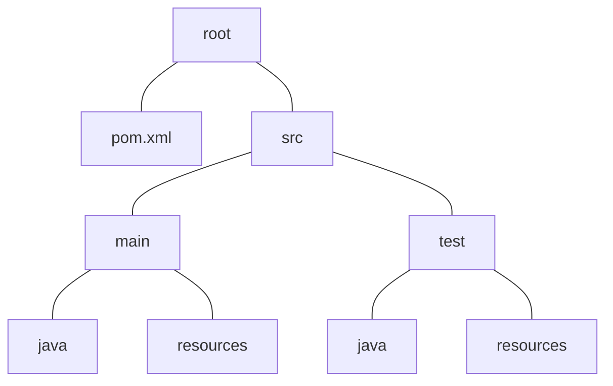
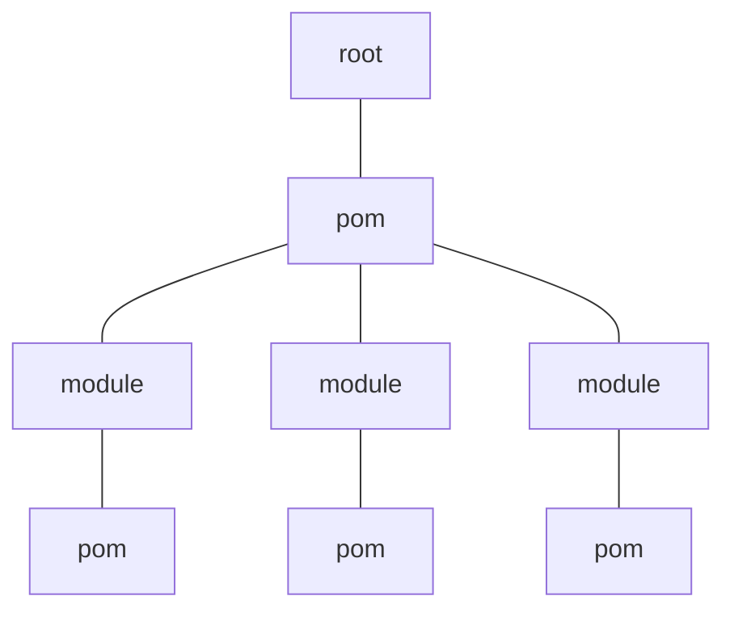

# Apache Maven
Original focus was on building software. Additionally it has so many extra feature like maintain, document and publish the artifacts.

It's base is the **P**roject **O**bject **M**odel.
## Structure, restrictions
In the community, there are some complaints about it, but Maven has established a common practice for organizing files in a project.

- Separates code from resources,
- separates runtime code from tests,
- standard directory structure,
- uses a convention-over-configuration approach.

## Lifecycles
Lifecycles define a structured sequence of build phases that dictate how a project is built and managed.

Each lifecycle consists of phases, which in turn execute goals from plugins.
> Lifecycles contain multiple phases,
> phases execute one or more plugin goals,
> goals are specific tasks provided by Maven plugins.
> 
> F.e. goal: `maven-jar-plugin:jar`, phase: `package`, lifecycle: `default`

Maven provides three built-in lifecycles.
### Default Lifecycle (Core Build Process)
It is the most commonly used and consists of **23 phases** such as
* `validate` ensures all necessary information is available,
* `compile` compiles source code,
* `test` runs unit tests using `maven-surefire-plugin`,
* `package` packages compiled code into a JAR/WAR/EAR,
* `verify` runs integration tests to validate the package,
* `install` installs the package into the local Maven repository (`~/.m2`),
* `deploy` uploads the artifact to a remote repository for sharing.
### Clean Lifecycle (Removing old builds)
Ensures that any previous build artifacts are removed before a fresh build. It consists of three phases
1. `pre-clean` performs pre-cleanup tasks,
2. `clean` deletes `target/` directory,
3. `post-clean` performs post-cleanup tasks.
### Site Lifecycle (Project documentation & reports)
Generates project documentation (like Javadoc, dependency reports, and test reports). It consists of four phases
1. `pre-site` prepares documentation generation,
2. `site` generates site documentation,
3. `post-site` finalizes site documentation,
4. `site-deploy` deploys the site to a web server.
# POM file
An **artifact** in Maven is any output of a project that is packaged and stored in a repository, such as a JAR, WAR, EAR, or POM file. Each artifact is uniquely identified by `groupId`, `artifactId`, `version`, `packaging`, and `classifier`.

Details, dependencies, build and reporting informations.
## Top header definitions
* `groupId`
* `artifactId`
* `version`
## `<properties>`
Its purpose to
- reduce duplication
- streamlines configuration
- keep items in sync
- aids in upgrades
```java
<properties>
	<jackson.version>x.x.x</jackson.version>
</properties>

...

<dependency>
	<groupId>com.fasterxml.jackson.core</groupId>
	<artifactId>jackson-core</artifactId>
	<version>${jackson.version}</version>
</dependency>
```

> If the **child POM does not define the property**, it inherits the parent's value.
> If the child uses `${parent.property}`, it **explicitly pulls the parent's value**.
>
> If the **child POM redefines the same property**, the child's definition takes precedence over the parent's.
> Properties in **profiles or command-line arguments** can further override properties from both parent and child POMs.
## `<dependencies>`
External libraries or artifacts that a project needs to compile, run, or test. Maven automatically downloads and manages them.
```java
<dependency>
	<groupId>...</groupId>
	<artifactId>...</artifactId>
	<version>...</version>
	<scope>...</scope>
</dependency>
```
### Scopes
Define where and how dependencies are available in a project.
* `compile` (default) is alway avaialable in all _ClassPath_ loaders that the artifact is in or that it goes trough, compile, runtime, execution, ...
*  `provided` when the artifact is packaged we will not see the provided dependency, but instead are expecting the application server or a rintime to provide the dependency for us. These dependencies are also not transitive.
* `runtime` is only needed for execution, not needed for compilation, exists in runtime and test classpaths. F.e. APIs.
* `test` is only available for test compilation and execution classpaths, f.e. unit test frameworks. They are not transitive.
* `system` similar to provided but have to specify the location.
* `import` only applies to POM files.
> In cloud computing this is not used because violates the 12 factor principle, but instead it is used in large scale Enterprise deployments.
### Transitive dependencies - dependencies of dependencies
Reduce
* scope of declaring dependencies,
* need to know inner workings,
* risk of upgrading.
#### Rules
- <span id = "closest-version">Closest version</span>
   ```mermaid
   graph LR
   A --- B --- E1[E 1.0]
   A --- C --- D --- E2[E 1.2]
   ```
   _E 1.0_ will be choosen because it's closer to _A_.
- Dependency management (`<dependency>` and artifact defined) beats closer version.
- Scopes can play a role in what is included.
- Local definition rules them all.

> Best practices are
> - only declare what we need,
> - validate scope,
> - consider parent POMs to control versions,
> - always declare when risk of breaking,
> - always declare when risk of security.

## `<build>`
It is where Maven defines how to build the project, contains plugins, configurations, resource filters, and output settings. It controls compilation, testing, packaging, and deployment.
### Plugins
[Plugins](https://maven.apache.org/plugins/) perform tasks such as compiling code, running tests, packaging JARs, deploying artifacts, and more.
##### Core plugins
_clean, compiler, deploy, failsafe, install, resources, site, ..._
##### Tool plugins
These ones are used to manage, see through, restrict things during the build, f.e.
* _dependency_ is used to moderatore artifacts,
* _enforcer_ is used to provide goals to control certain envirmental constraints such as JDK version and many more,
* _release_ is used to release a project with the Maven.
##### Packaging plugins
`ear, war, ...`
##### Reporting plugins
`changelog, javadoc, surefire-report`
## `reporting`
It's purpose is to generate project documentation and reports that provide insights into the project's structure, dependencies, code quality, test results, and other metrics.

Mainly handled by the _site_ lifecycle and various reporting plugins. 
## `Repositories`
## `PluginRepositories`
## `Profiles`
# Parent POM
It is a file that is stand alone meaning that there is no code associated with it, thus it must be packaged as POM.

Used to control dependency and plugin versions for subordinate projects in one place.
## Reactors, multi modules
Reactors are used to build a group of related projects through the use of the parent POM. responsible for building the multiple modules in a specific order, ensuring dependencies are resolved correctly, meaning if _B_ dependency depends on _A_, then _A_ will be resolved first.

### Dependency resolution
- If the dependency is declared in the parent and not in the children components, all the children inherits it.
- If the parent declares a dependency version using `<dependencyManagement>`, then the children component only need to declare the dependency without the version.
> Basically what it means that the children project requires the dependencies, but the parent will determine their scope and version.
- If children components define the same dependency with the same version, then it's downloaded only once, on the contray if the version differs then the maven <ins>will chose the [nearest](#closest-version) or first resolved one</ins>.
# Archetypes
# Reporting
## Maven sites

# Commands
```java
# resolves and downloads the dependencies specified in the `pom.xml` to the local repository
mvn dependency:resolve

# detect unused or undeclared dependencies
mvn dependency:analyze

# displays a tree structure of the project's dependencies, showing how they are related to each other
mvn dependency:tree
```
<!--stackedit_data:
eyJoaXN0b3J5IjpbLTYyMDA1ODk5XX0=
-->